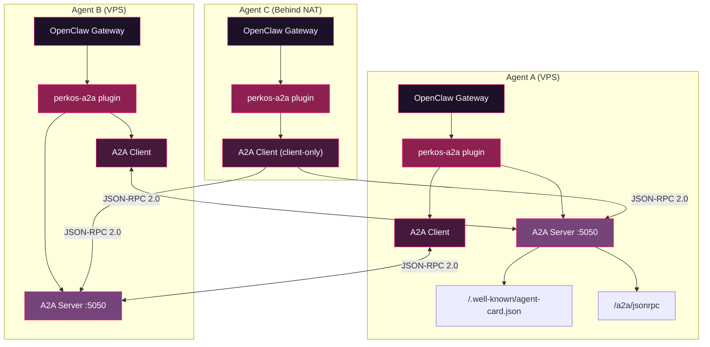
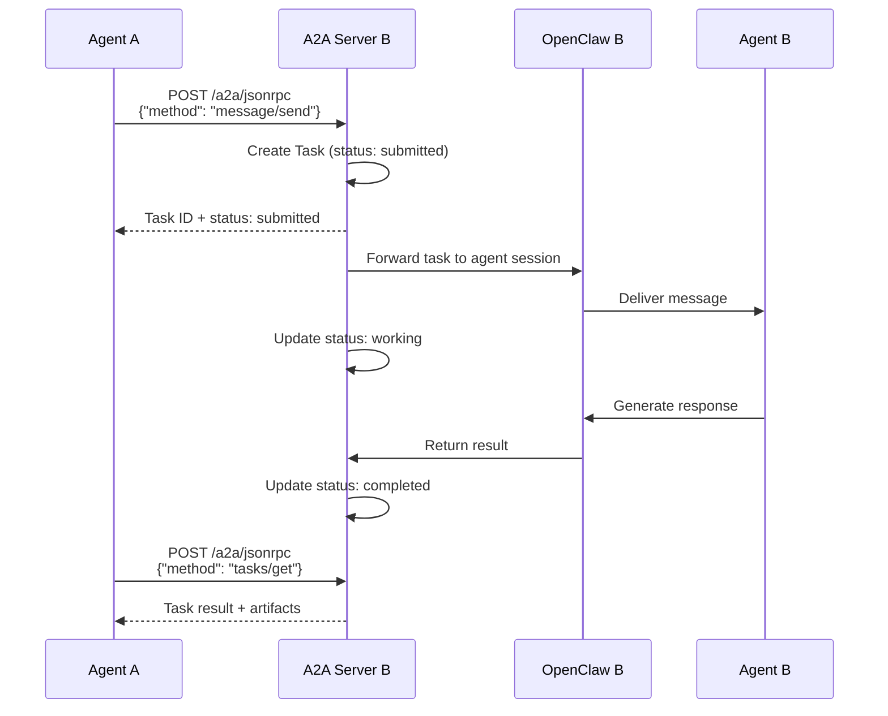
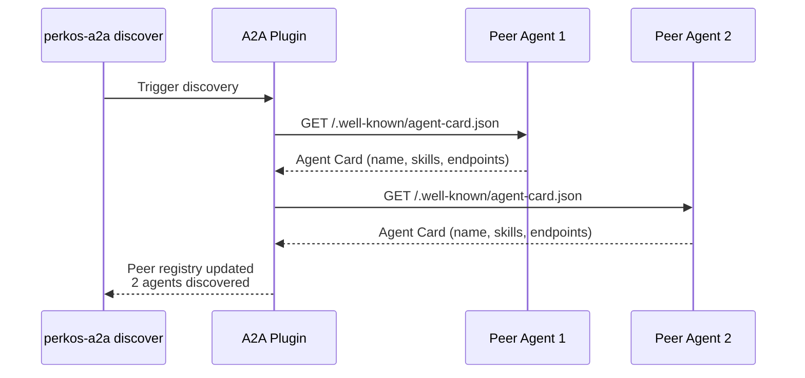

# @perkos/perkos-a2a

Agent-to-Agent (A2A) protocol plugin for [OpenClaw](https://openclaw.ai). Enables multi-agent communication using Google's A2A protocol specification.

## Quick Start

```bash
# Install the plugin
openclaw plugin install @perkos/perkos-a2a

# Run the setup wizard to detect your environment
openclaw perkos-a2a setup

# Check status
openclaw perkos-a2a status
```

Add to your `openclaw.json`:

```json
{
  "plugins": {
    "entries": {
      "perkos-a2a": {
        "config": {
          "agentName": "my-agent",
          "port": 5050,
          "mode": "auto",
          "peers": {
            "other-agent": "http://10.0.0.2:5050"
          }
        }
      }
    }
  }
}
```

## Architecture



## Task Lifecycle



## Agent Discovery



## Networking Guide

### VPS / Public IP

If your agent runs on a VPS with a public IP, you're ready to go. Configure peers with your public IP:

```json
"peers": {
  "agent-b": "http://203.0.113.10:5050"
}
```

### Behind NAT (macOS / Laptop)

Most development machines are behind NAT. The plugin auto-detects this and offers options:

**Tailscale (recommended):**
1. Install Tailscale: https://tailscale.com
2. Both agents join the same tailnet
3. Use Tailscale IPs for peers:
   ```json
   "peers": { "agent-b": "http://100.64.0.2:5050" }
   ```

**Cloudflare Tunnel:**
1. Set up `cloudflared` to expose port 5050
2. Use the tunnel URL for peers

**Client-only mode:**
If you only need to send tasks (not receive), set `"mode": "client-only"`. No server is started.

## CLI Commands

```bash
openclaw perkos-a2a setup      # Detect environment and show recommendations
openclaw perkos-a2a status     # Show agent status and config
openclaw perkos-a2a discover   # Discover peer agents
openclaw perkos-a2a send <target> <message>  # Send a task to a peer
```

## Configuration

| Option      | Type     | Default  | Description                                    |
|-------------|----------|----------|------------------------------------------------|
| `agentName` | string   | "agent"  | This agent's name in the council               |
| `port`      | number   | 5050     | HTTP server port (avoid 5000 on macOS/AirPlay) |
| `mode`      | string   | "auto"   | `full`, `client-only`, or `auto` (detect)      |
| `skills`    | array    | []       | Skills this agent exposes via A2A              |
| `peers`     | object   | {}       | Map of peer names to A2A base URLs             |

### Mode Details

- **auto** (default): Detects NAT/Tailscale. Falls back to client-only if behind NAT with no tunnel. Also falls back if port is unavailable.
- **full**: Always starts the HTTP server. Fails loudly if port is in use.
- **client-only**: No HTTP server. Can send tasks and discover peers but cannot receive inbound tasks.

## Agent Tools

When the plugin is active, three tools are available to the agent:

- `a2a_discover` -- Discover all configured peer agents and their capabilities
- `a2a_send_task` -- Send a task to a named peer agent
- `a2a_task_status` -- Check the status of a previously sent task

## Troubleshooting

**Port 5050 in use:**
Change the port in config, or run `lsof -i :5050` to find the conflicting process.

**Port 5000 on macOS:**
macOS Monterey+ uses port 5000 for AirPlay Receiver. Use 5050 (the default) instead.

**Peers show offline:**
- Verify the peer URL is correct and reachable
- Check firewalls/security groups
- If behind NAT, ensure both agents are on the same tailnet or have tunnel access

**Auto mode starts client-only unexpectedly:**
- Run `openclaw perkos-a2a setup` to diagnose
- Force `"mode": "full"` if you know the port is accessible

## License

MIT
