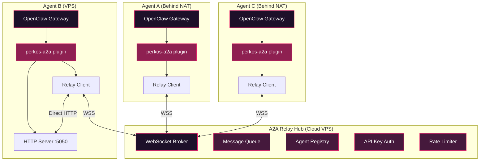
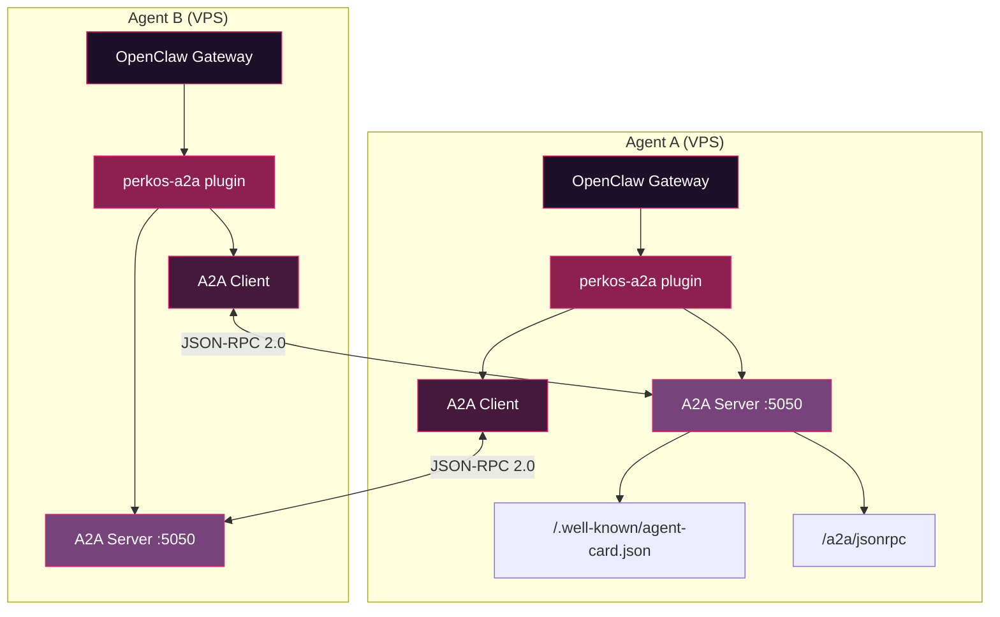
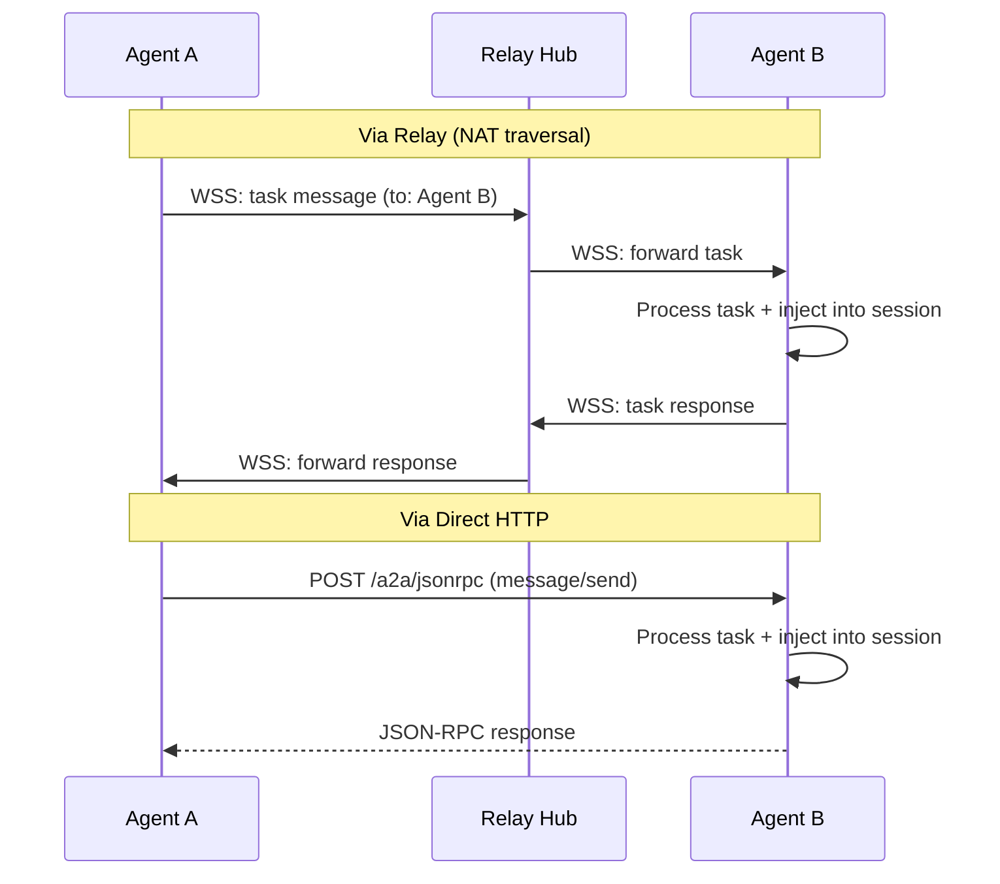

# @perkos/perkos-a2a

Agent-to-Agent (A2A) protocol plugin for [OpenClaw](https://openclaw.ai). Enables multi-agent communication using Google's A2A protocol specification with enterprise-grade relay infrastructure for NAT traversal.

## ⚠️ How Message Delivery Works (READ THIS FIRST)

**Tasks are NOT delivered in real-time.** Understanding this is critical:

1. When Agent A sends a task to Agent B, the task is **enqueued** on Agent B's A2A server
2. The task is injected into Agent B's context at the **start of their next turn** (via the `before_agent_start` hook)
3. This means Agent B will only see the message **when their human writes something** (triggering a new turn)
4. A `completed` status on `perkos_a2a_send` means "delivered to the queue" — **NOT** "the agent read and processed it"

**To inspect pending tasks manually:**
```bash
curl -s -X POST http://localhost:<PORT>/a2a/jsonrpc \
  -H "Content-Type: application/json" \
  -d '{"jsonrpc":"2.0","method":"tasks/list","id":1,"params":{}}' | python3 -m json.tool
```

**Fallback:** If session injection is not available, tasks are written as markdown files to the workspace.

## Quick Start

```bash
# Install the plugin
openclaw plugin install @perkos/perkos-a2a

# Run the setup wizard to detect your environment
openclaw perkos-a2a setup

# Check status
openclaw perkos-a2a status
```

Add to your `openclaw.json`:

```json
{
  "plugins": {
    "entries": {
      "perkos-a2a": {
        "config": {
          "agentName": "my-agent",
          "port": 5050,
          "mode": "auto",
          "peers": {
            "other-agent": "http://10.0.0.2:5050"
          },
          "relay": {
            "url": "wss://relay.perkos.xyz",
            "apiKey": "your-agent-api-key",
            "enabled": true
          },
          "peerAuth": {
            "other-agent": "their-api-key"
          },
          "auth": {
            "requireApiKey": true,
            "apiKeys": ["key1", "key2"]
          }
        }
      }
    }
  }
}
```

## Architecture

### Relay Hub (NAT Traversal)

Agents behind NAT connect outbound to the relay hub via WebSocket. The relay routes messages between agents, queues messages for offline agents, and maintains a presence registry.



### Direct Peer-to-Peer

Agents on the same network or with public IPs can communicate directly via HTTP without a relay.



## Task Lifecycle



## Running the Relay Hub

The relay hub is a lightweight WebSocket broker. Deploy it on any VPS with a public IP.

```bash
# Via npx (development)
npx tsx bin/relay.ts --port 6060 --api-keys key1,key2

# Via environment variables
RELAY_PORT=6060 RELAY_API_KEYS=key1,key2 npx tsx bin/relay.ts
```

### Relay Hub Options

| Option | Env Var | Default | Description |
|---|---|---|---|
| `--port` | `RELAY_PORT` | 6060 | WebSocket listen port |
| `--api-keys` | `RELAY_API_KEYS` | (none) | Comma-separated accepted API keys |
| `--max-queue` | `RELAY_MAX_QUEUE` | 200 | Max queued messages per offline agent |
| `--rate-limit` | `RELAY_RATE_LIMIT` | 60 | Max messages per agent per minute |

## Modes

| Mode | HTTP Server | Relay Client | Use Case |
|---|---|---|---|
| `auto` | Conditional | If configured | Detects NAT, chooses best option |
| `full` | Yes | If configured | VPS with public IP |
| `client-only` | No | If configured | Behind NAT, no local server |
| `relay` | No | No | Run as relay hub only |

## Configuration

```json
{
  "agentName": "my-agent",
  "port": 5050,
  "mode": "auto",
  "skills": [],
  "peers": {
    "other-agent": "http://10.0.0.2:5050"
  },
  "relay": {
    "url": "wss://relay.perkos.xyz",
    "apiKey": "agent-specific-key",
    "enabled": true
  },
  "peerAuth": {
    "other-agent": "their-api-key"
  },
  "auth": {
    "requireApiKey": true,
    "apiKeys": ["key1", "key2"]
  }
}
```

| Option | Type | Default | Description |
|---|---|---|---|
| `agentName` | string | `"agent"` | This agent's name in the council |
| `port` | number | `5050` | HTTP server port |
| `mode` | string | `"auto"` | Operating mode (see table above) |
| `skills` | array | `[]` | Skills exposed via A2A |
| `peers` | object | `{}` | Direct peer URLs |
| `peerAuth` | object | `{}` | API keys for outbound requests to specific peers |
| `relay.url` | string | - | Relay hub WebSocket URL |
| `relay.apiKey` | string | - | API key for relay authentication |
| `relay.enabled` | boolean | `false` | Enable relay connectivity |
| `auth.requireApiKey` | boolean | `false` | Require API key for inbound HTTP |
| `auth.apiKeys` | string[] | `[]` | Accepted API keys for inbound HTTP |

## Authentication

### Relay Auth

Agents authenticate with the relay hub using an API key provided during WebSocket registration. The relay rejects connections with invalid keys.

### HTTP Auth

When `auth.requireApiKey` is enabled, inbound HTTP requests must include an API key via:
- `X-API-Key` header
- `Authorization: Bearer <key>` header
- `?apiKey=<key>` query parameter

## Session Injection

When a task is received, the plugin attempts to inject it directly into the agent's OpenClaw session using the plugin API (`api.injectMessage`). If session injection is not available, tasks fall back to writing markdown files to the workspace.

## Agent Tools

When the plugin is active, three tools are available to the agent:

- `perkos_a2a_discover` -- Discover all configured peer agents and their capabilities (direct + relay)
- `perkos_a2a_send` -- Send a task to a named peer agent (tries direct HTTP, falls back to relay)
- `perkos_a2a_status` -- Check the status of a previously sent task

## CLI Commands

```bash
openclaw perkos-a2a setup      # Detect environment and show recommendations
openclaw perkos-a2a status     # Show agent status, relay connection, and config
openclaw perkos-a2a discover   # Discover peer agents (direct + relay)
openclaw perkos-a2a send <target> <message>  # Send a task to a peer
```

## Networking Guide

### Option 1: Relay Hub (Recommended for NAT)

Deploy the relay hub on a VPS, configure all agents to connect to it. No port forwarding or tunnels needed.

### Option 2: Direct (Public IP / Same Network)

Agents with public IPs or on the same network can communicate directly via HTTP. Configure peer URLs in the `peers` config.

### Option 3: Tailscale

Both agents join the same tailnet. Use Tailscale IPs for peer URLs.

### Option 4: Client-Only

Set `"mode": "client-only"` to only send tasks (not receive). Combine with relay for full bidirectional support.

## Multi-Agent LAN Setup (Same WiFi)

When running multiple agents on the same local network, follow this guide:

### Step 1: Assign unique ports

Each agent needs its own port. Example:

| Agent | Port |
|-------|------|
| agent-a | 5050 |
| agent-b | 5051 |
| agent-c | 5052 |

### Step 2: Get each agent's local IP

On each Mac, run:
```bash
/sbin/ifconfig | grep "inet " | grep -v 127.0.0.1
```
Example output: `inet 192.168.1.101 netmask 0xffffff00 broadcast 192.168.1.255`

### Step 3: Configure each agent's `openclaw.json`

Each agent needs `mode: "full"` and **all other agents** as peers (not itself):

**Agent A (192.168.1.101:5050):**
```json
{
  "perkos-a2a": {
    "enabled": true,
    "config": {
      "agentName": "agent-a",
      "port": 5050,
      "mode": "full",
      "peers": {
        "agent-b": "http://192.168.1.102:5051",
        "agent-c": "http://192.168.1.103:5052"
      }
    }
  }
}
```

**Agent B (192.168.1.102:5051):**
```json
{
  "perkos-a2a": {
    "enabled": true,
    "config": {
      "agentName": "agent-b",
      "port": 5051,
      "mode": "full",
      "peers": {
        "agent-a": "http://192.168.1.101:5050",
        "agent-c": "http://192.168.1.103:5052"
      }
    }
  }
}
```

### Step 4: Restart each gateway

```bash
openclaw gateway restart
```

### Step 5: Verify connectivity

From any agent, use the `perkos_a2a_discover` tool or:
```bash
curl -s http://<peer-ip>:<peer-port>/a2a/jsonrpc \
  -X POST -H "Content-Type: application/json" \
  -d '{"jsonrpc":"2.0","method":"tasks/list","id":1,"params":{}}'
```

### Important notes

- **No relay needed** for LAN — set `relay.enabled: false`
- **macOS port 5000** is used by AirPlay Receiver — avoid it
- All agents must use `mode: "full"` to both send AND receive
- **Messages are not instant** — see "How Message Delivery Works" section above
- After config changes, always `openclaw gateway restart`

## Troubleshooting

**Relay connection failing:**
- Verify the relay URL is correct and reachable
- Check that your API key matches one configured on the relay hub
- Look for `[perkos-a2a]` log messages for connection errors

**Port 5050 in use:**
Change the port in config, or run `lsof -i :5050` to find the conflicting process.

**Peers show offline:**
- Verify the peer URL is correct and reachable
- Check firewalls/security groups
- If using relay, verify both agents are connected to the same relay hub

**Auth errors (401):**
- Ensure your API key is in the target agent's `auth.apiKeys` list
- Check `X-API-Key` header is being sent correctly

## License

MIT
