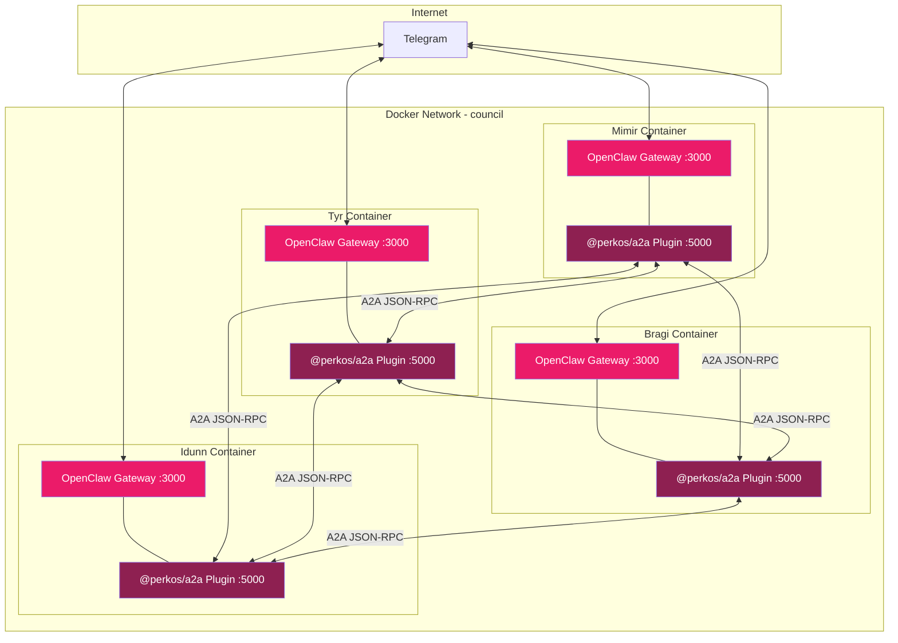
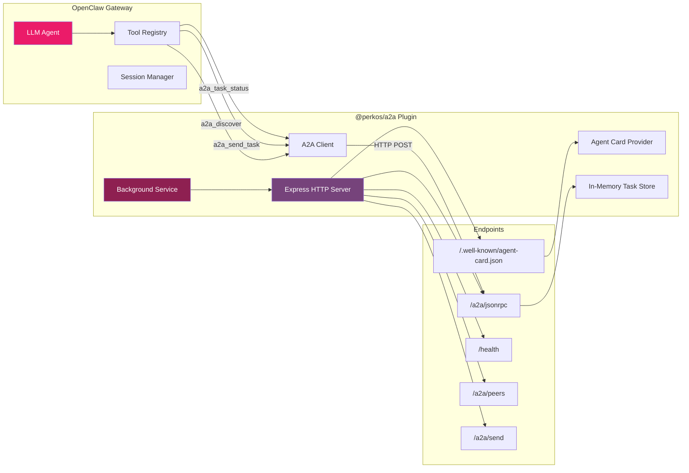
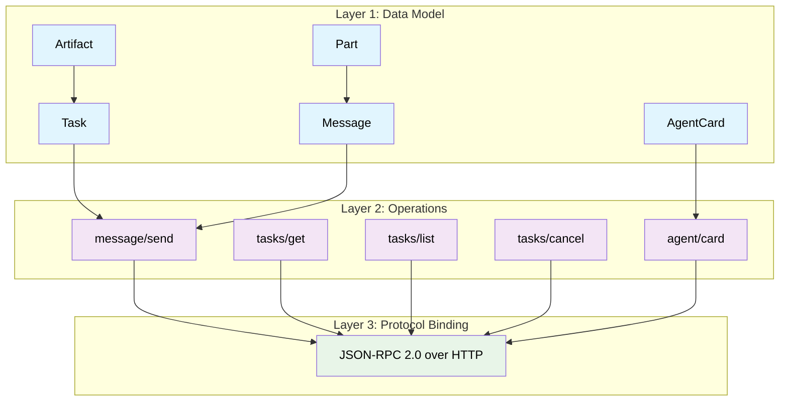
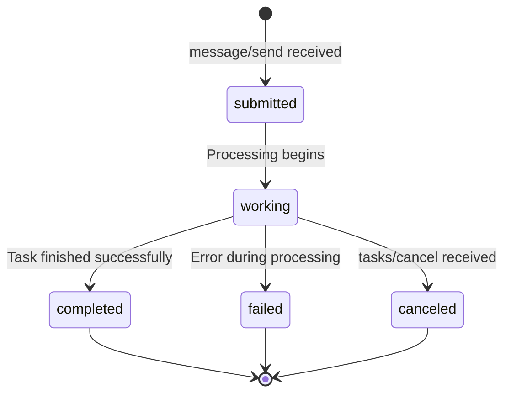
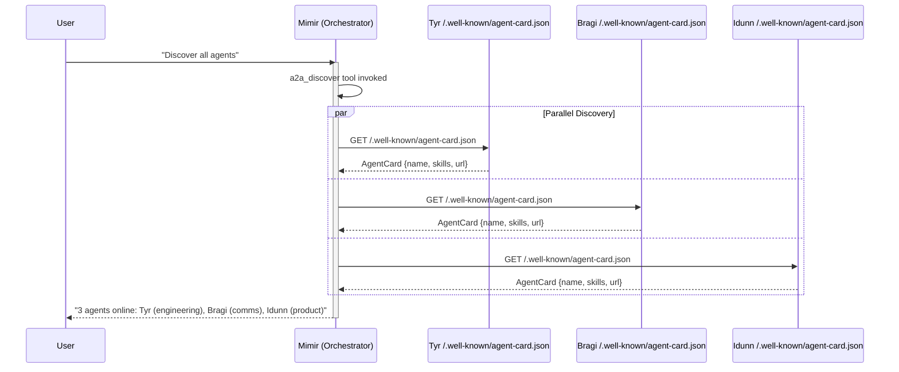
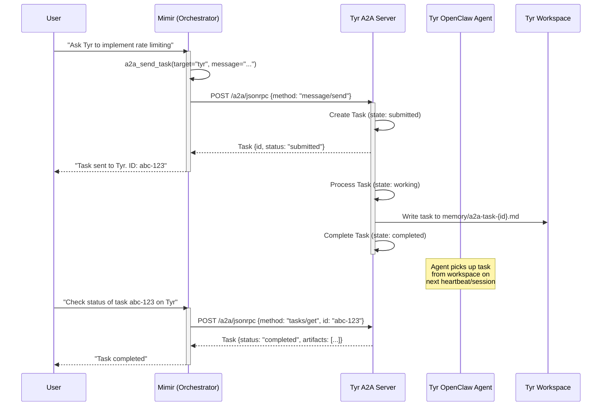
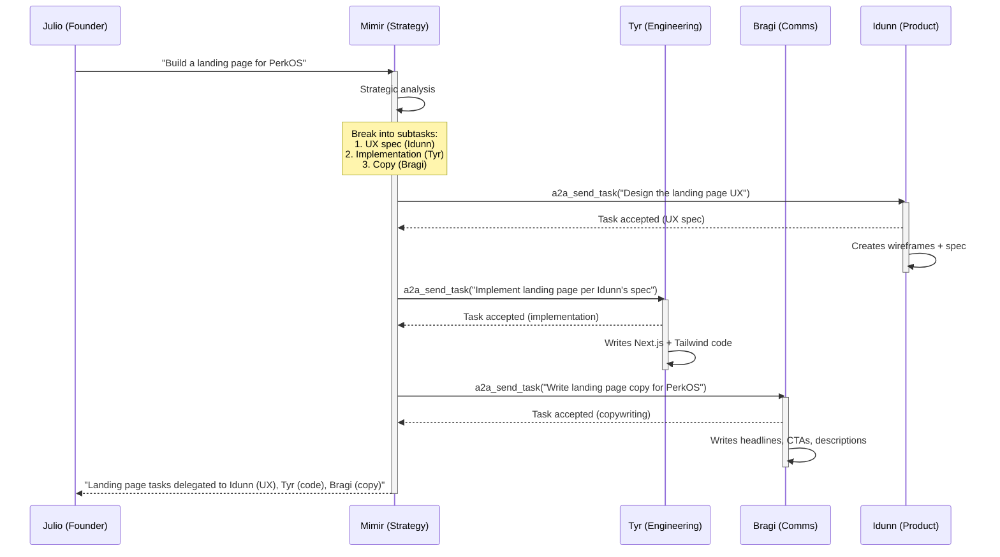

# @perkos/a2a

Agent-to-Agent (A2A) protocol communication plugin for [OpenClaw](https://github.com/openclaw/openclaw).

Implements Google's [A2A Protocol](https://github.com/a2aproject/A2A) (v0.3.0) to enable OpenClaw agents to discover each other, send tasks, and collaborate autonomously.

## Features

- **Agent Card Discovery** — Each agent publishes identity and skills at `/.well-known/agent-card.json`
- **JSON-RPC 2.0** — Standard A2A protocol methods: `message/send`, `tasks/get`, `tasks/list`, `tasks/cancel`
- **OpenClaw Tools** — `a2a_discover`, `a2a_send_task`, `a2a_task_status` available to the LLM
- **CLI Commands** — `openclaw a2a status`, `openclaw a2a discover`, `openclaw a2a send`
- **Peer Discovery** — Automatic discovery of online agents in the network
- **Background Service** — A2A HTTP server runs alongside the OpenClaw gateway

## Architecture

### System Overview



### Plugin Architecture



## Protocol Specification

### A2A Protocol Layers

This plugin implements the three layers of the A2A Protocol Specification:



### Task Lifecycle



### Agent Discovery Sequence



### Task Delegation Sequence



### Multi-Agent Collaboration Sequence



## Data Model

### Agent Card

Each agent publishes an Agent Card describing its identity and capabilities:

```json
{
  "name": "Tyr",
  "description": "Engineering and execution agent",
  "protocolVersion": "0.3.0",
  "version": "1.0.0",
  "url": "http://perkos-tyr:5000/a2a/jsonrpc",
  "skills": [
    {
      "id": "code",
      "name": "Code Implementation",
      "description": "Write production-quality TypeScript, Solidity, Next.js code",
      "tags": ["coding", "typescript", "solidity"]
    }
  ],
  "capabilities": { "pushNotifications": false },
  "defaultInputModes": ["text"],
  "defaultOutputModes": ["text"]
}
```

### Task

Tasks track the lifecycle of delegated work:

```json
{
  "kind": "task",
  "id": "f49f9755-86b9-4399-9463-fa6b9a11b51a",
  "contextId": "cc57cc50-762c-41d4-b9a1-59b1ee691a69",
  "status": {
    "state": "completed",
    "timestamp": "2026-03-12T16:24:45.709Z"
  },
  "messages": [
    {
      "kind": "message",
      "messageId": "a008eb3e-2fb0-4947-b1e4-15a6d3a8cba5",
      "role": "user",
      "parts": [{ "kind": "text", "text": "Implement rate limiting on the API" }],
      "metadata": { "fromAgent": "mimir" }
    }
  ],
  "artifacts": [
    {
      "kind": "artifact",
      "artifactId": "b2c3d4e5-...",
      "parts": [{ "kind": "text", "text": "Task queued for processing" }]
    }
  ]
}
```

### Message

Messages are communication turns between agents:

```json
{
  "kind": "message",
  "messageId": "unique-id",
  "role": "user",
  "parts": [
    { "kind": "text", "text": "Your task description here" }
  ],
  "metadata": {
    "fromAgent": "mimir"
  }
}
```

## JSON-RPC 2.0 Methods

| Method | Description | Request Params | Response |
|--------|------------|----------------|----------|
| `message/send` | Send a task to the agent | `{message: Message}` | `Task` |
| `tasks/get` | Get task by ID | `{id: string}` | `Task` |
| `tasks/list` | List all tasks | `{}` | `{tasks: Task[]}` |
| `tasks/cancel` | Cancel a running task | `{id: string}` | `Task` |
| `agent/card` | Get the agent's card | `{}` | `AgentCard` |

### Example JSON-RPC Request

```json
{
  "jsonrpc": "2.0",
  "method": "message/send",
  "id": "req-1",
  "params": {
    "message": {
      "kind": "message",
      "messageId": "msg-1",
      "role": "user",
      "parts": [{"kind": "text", "text": "Review the API security"}],
      "metadata": {"fromAgent": "mimir"}
    }
  }
}
```

### Example JSON-RPC Response

```json
{
  "jsonrpc": "2.0",
  "id": "req-1",
  "result": {
    "kind": "task",
    "id": "task-uuid",
    "contextId": "ctx-uuid",
    "status": {"state": "submitted", "timestamp": "2026-03-12T16:00:00Z"},
    "messages": [...],
    "artifacts": []
  }
}
```

## HTTP Endpoints

| Endpoint | Method | Description |
|----------|--------|-------------|
| `/.well-known/agent-card.json` | GET | A2A Agent Card (discovery) |
| `/a2a/jsonrpc` | POST | JSON-RPC 2.0 endpoint |
| `/a2a/peers` | GET | Discover all peer agents |
| `/a2a/send` | POST | REST convenience for sending tasks |
| `/health` | GET | Health check with agent info |

## OpenClaw Integration

### Registered Tools

| Tool | Description | Parameters |
|------|-------------|------------|
| `a2a_discover` | Discover peer agents and capabilities | none |
| `a2a_send_task` | Send a task to a peer agent | `target`, `message` |
| `a2a_task_status` | Check status of a sent task | `target`, `taskId` |

### CLI Commands

```bash
openclaw a2a status      # Show A2A agent configuration
openclaw a2a discover    # Discover and list peer agents
openclaw a2a send <agent> <message>  # Send a task to a peer
```

### Gateway RPC

```bash
openclaw gateway call a2a.status  # Get A2A status via RPC
```

## ⚠️ macOS Note

On macOS, **port 5000 is used by AirPlay Receiver** (ControlCenter). The default port is `5050` to avoid conflicts. If the configured port is in use, the plugin automatically tries the next port (up to 3 attempts). Docker/Linux agents can still use port 5000 via explicit config.

## Installation

### From npm

```bash
openclaw plugins install @perkos/a2a
```

### Manual Installation

```bash
git clone https://github.com/PerkOS-xyz/PerkOS-A2A.git
cd PerkOS-A2A
npm install
npm run build
openclaw plugins install -l .
```

## Configuration

Add to your `openclaw.json`:

```json5
{
  plugins: {
    entries: {
      "perkos-a2a": {
        enabled: true,
        config: {
          // This agent's name in the network
          agentName: "mimir",
          // Port for the A2A HTTP server (default 5050; use 5000 on Linux/Docker)
          port: 5050,
          // Skills this agent exposes
          skills: [
            {
              id: "strategy",
              name: "Strategic Planning",
              description: "Break down goals into actionable tasks",
              tags: ["planning", "strategy"]
            }
          ],
          // Peer agents (name -> A2A URL)
          peers: {
            tyr: "http://perkos-tyr:5000",
            bragi: "http://perkos-bragi:5000",
            idunn: "http://perkos-idunn:5000"
          }
        }
      }
    }
  }
}
```

### Configuration Options

| Option | Type | Default | Description |
|--------|------|---------|-------------|
| `agentName` | string | `"agent"` | This agent's name in the network |
| `port` | number | `5050` | Port for the A2A HTTP server (macOS avoids 5000/AirPlay) |
| `skills` | array | `[]` | Skills to advertise in the Agent Card |
| `peers` | object | `{}` | Map of peer agent names to A2A URLs |

## Docker Deployment

For multi-agent setups, use Docker Compose with a shared network:

```yaml
services:
  mimir:
    build: .
    container_name: perkos-mimir
    ports:
      - "3001:3000"  # OpenClaw
      - "5001:5000"  # A2A
    environment:
      - AGENT_NAME=mimir
    networks:
      - council

  tyr:
    build: .
    container_name: perkos-tyr
    ports:
      - "3002:3000"
      - "5002:5000"
    environment:
      - AGENT_NAME=tyr
    networks:
      - council

networks:
  council:
    driver: bridge
```

Agents can discover each other via Docker DNS: `http://perkos-tyr:5000`.

## A2A Protocol Compliance

This plugin implements the [A2A Protocol Specification RC v1.0](https://a2a-protocol.org/latest/specification/):

| Feature | Status |
|---------|--------|
| Agent Card at `/.well-known/agent-card.json` | ✅ |
| JSON-RPC 2.0 binding | ✅ |
| `message/send` | ✅ |
| `tasks/get` | ✅ |
| `tasks/list` | ✅ |
| `tasks/cancel` | ✅ |
| Task lifecycle states | ✅ |
| Text parts | ✅ |
| Artifact generation | ✅ |
| Streaming (SSE) | 🔜 Planned |
| Push notifications | 🔜 Planned |
| File parts | 🔜 Planned |
| gRPC binding | 🔜 Planned |

## TypeScript Types

The plugin exports full TypeScript types for the A2A protocol:

```typescript
import type {
  AgentCard,
  AgentSkill,
  Task,
  TaskStatus,
  Message,
  Part,
  Artifact,
  JsonRpcRequest,
  JsonRpcResponse,
  A2APluginConfig,
} from "@perkos/a2a";
```

## Standalone Server

You can also use the A2A server independently of OpenClaw:

```typescript
import { A2AServer } from "@perkos/a2a";

const server = new A2AServer({
  agentName: "my-agent",
  port: 5050,
  skills: [{ id: "chat", name: "Chat", description: "General chat", tags: [] }],
  peers: {
    other: "http://other-agent:5050",
  },
});

server.start();
```

## License

MIT

## Links

- [A2A Protocol Specification](https://a2a-protocol.org/latest/specification/)
- [A2A GitHub](https://github.com/a2aproject/A2A)
- [A2A JS SDK](https://github.com/a2aproject/a2a-js)
- [OpenClaw](https://github.com/openclaw/openclaw)
- [PerkOS](https://perkos.xyz)
